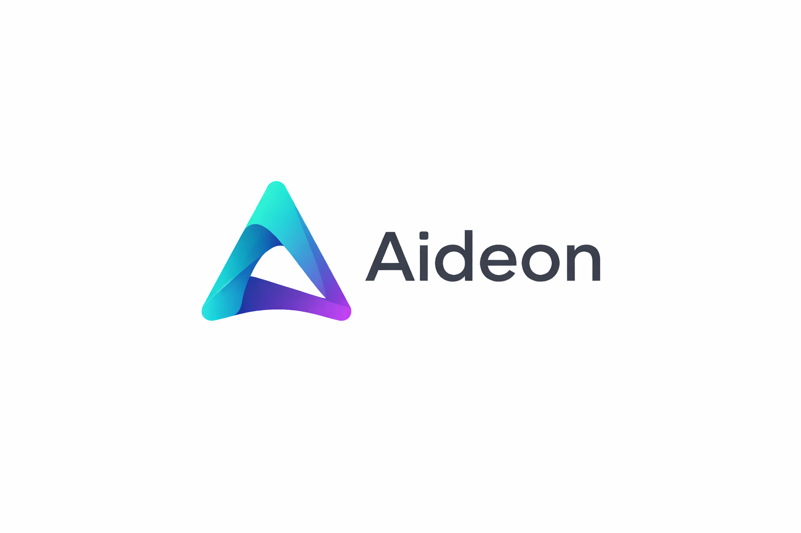

# Aideon AI

Aideon AI builds software for organisations that need to see how strategy, capability, execution,
technology, and change connect over time.

We think operational software should help people see what is changing, why it is changing, and what
follows from it. Too many tools flatten that into static diagrams, spreadsheet archaeology, or a
pile of disconnected apps. We are trying to build something clearer, calmer, and more useful.

That pushes us toward time-aware models, explicit workflows, typed contracts, and products that
stay usable even when the underlying system gets messy.

## What Aideon AI Is Building

We're building a modular platform for teams that need a clearer picture of how their organisation
actually works:

- modelling business and technical reality in a form the system can reason about
- keeping a history of facts, events, and changes instead of only the latest state
- running analytics and integrity checks over that model
- turning results into artefacts people can read, share, and act on
- automating repeatable work without burying the logic underneath

That is why the platform is split into distinct capability areas instead of being forced into one
oversized application.

## Platform Capabilities

- Praxis defines meaning, task models, artefacts, and interaction semantics.
- Mneme stores event history, durable state, projections, and schema-as-data.
- Metis runs analytics, ranking, diagnostics, and reasoning support.
- Chrona handles time-aware views, scenario handling, and temporal interpretation.
- Continuum handles orchestration, scheduling, connectors, and automation.

Around those modules sit the host applications, shared contracts, runtime libraries, and design
system needed to turn the platform into real products.

## How We Think

- Time belongs in the model. We care about what is true now, what was true before, and what changed
  along the way.
- Boundaries should stay clear. Contracts let modules evolve without turning the whole system into
  guesswork.
- Important workflows should stay visible. If something matters, it should be typed, testable, and
  explainable.
- Local-first is the default. People should still be able to work when the network is unreliable or
  absent.

## What You’ll Find In This Organisation

- platform and host application repositories
- domain modules and supporting packages
- shared contracts and runtime libraries
- design system assets
- architecture, standards, ADRs, and planning material

## Current Direction

Right now the architecture is moving toward a contract-first, modular system with a web host, an
API host, and separately evolvable domain packages. The aim is simple: build tools that help people
think clearly about complex operations, work safely, and keep context over time.
